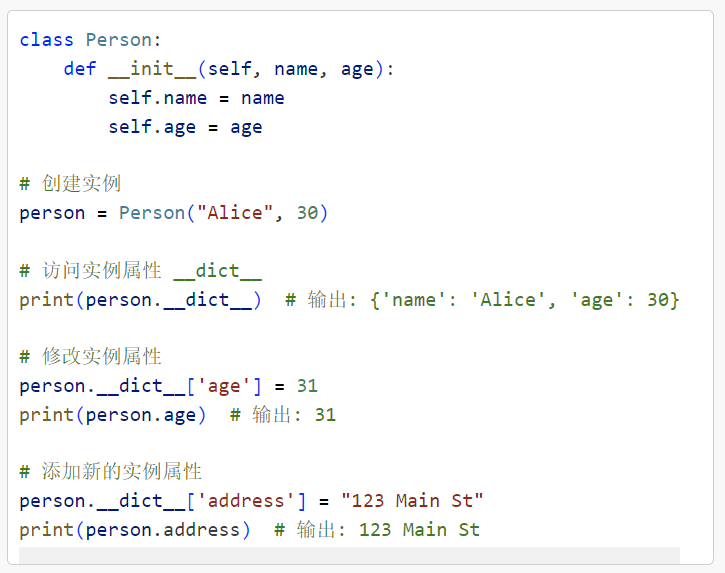
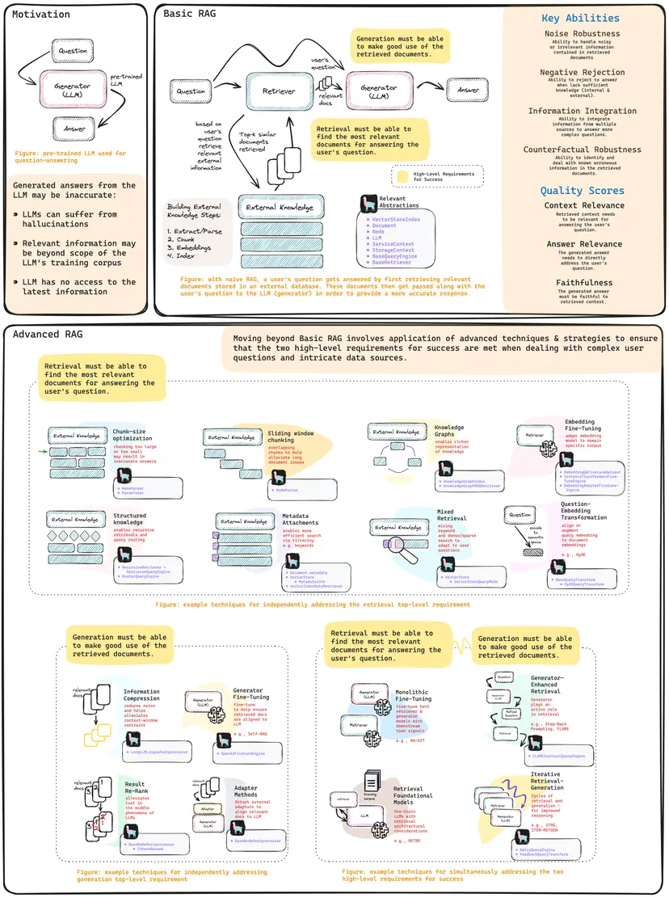

From: https://gamma.app/docs/OOP-m4y912u69aj3wk6?mode=doc

# 模块四_面向对象编程（OOP）与设计模式


## 学习目标

1. 借助大模型掌握 OOP
2. 继承
3. 设计模式与代码复用的提升
4. Llama-Index 的深入应用


## 一、借助大模型掌握 OOP

### 1.1 classmethod 与 staticmethod

使用 `classmethod` 创建**工厂方法**是一个常见的**设计模式**，特别是在需要根据不同的条件创建类的实例时。工厂方法可以让你在不直接调用类构造函数的情况下创建对象。

```python
class Pizza:
    def __init__(self, size, toppings):
        self.size = size
        self.toppings = toppings

    @classmethod
    def margherita(cls):
        return cls(size="Medium", toppings=["Tomato", "Mozzarella", "Basil"])

    @classmethod
    def pepperoni(cls):
        return cls(size="Large", toppings=["Tomato", "Mozzarella", "Pepperoni"])

    @classmethod
    def custom(cls, size, toppings):
        return cls(size=size, toppings=toppings)

    def __str__(self):
        return f"Pizza(size={self.size}, toppings={self.toppings})"

# 使用工厂方法创建不同类型的披萨
margherita_pizza = Pizza.margherita()
pepperoni_pizza = Pizza.pepperoni()
custom_pizza = Pizza.custom(size="Small", toppings=["Tomato", "Mozzarella", "Mushrooms"])

print(margherita_pizza)  # 输出: Pizza(size=Medium, toppings=['Tomato', 'Mozzarella', 'Basil'])
print(pepperoni_pizza)   # 输出: Pizza(size=Large, toppings=['Tomato', 'Mozzarella', 'Pepperoni'])
print(custom_pizza)      # 输出: Pizza(size=Small, toppings=['Tomato', 'Mozzarella', 'Mushrooms'])
```


不使用`classmethod`,直接调用类的构造函数

```python
class Pizza:
    def __init__(self, size, toppings):
        self.size = size
        self.toppings = toppings

    def __str__(self):
        return f"Pizza(size={self.size}, toppings={self.toppings})"

# 直接调用构造函数创建不同类型的披萨
margherita_pizza = Pizza(size="Medium", toppings=["Tomato", "Mozzarella", "Basil"])
pepperoni_pizza = Pizza(size="Large", toppings=["Tomato", "Mozzarella", "Pepperoni"])
custom_pizza = Pizza(size="Small", toppings=["Tomato", "Mozzarella", "Mushrooms"])

print(margherita_pizza)  # 输出: Pizza(size=Medium, toppings=['Tomato', 'Mozzarella', 'Basil'])
print(pepperoni_pizza)   # 输出: Pizza(size=Large, toppings=['Tomato', 'Mozzarella', 'Pepperoni'])
print(custom_pizza)      # 输出: Pizza(size=Small, toppings=['Tomato', 'Mozzarella', 'Mushrooms'])
```


**问题**：

**1 重复代码**：

每次创建对象时，都需要重复提供相同的参数。例如，创建 `margherita_pizza` 和 `pepperoni_pizza` 时，必须手动指定 `size` 和 `toppings`。

**2 易出错**：

如果参数较多或初始化逻辑复杂，手动提供所有参数容易出错。例如，可能会忘记某个参数或提供错误的值。

**3 缺乏抽象**：

直接调用构造函数缺乏抽象，不能很好地表达创建对象的意图。例如，`Pizza(size="Medium", toppings=["Tomato", "Mozzarella", "Basil"])` 不如 `Pizza.margherita()` 直观。


#### 类方法与工厂方法

**1 类方法**：

`@classmethod` 装饰器用于定义类方法。类方法的第一个参数是 `cls`，表示类本身。

`margherita` 和 `pepperoni` 是两个类方法，它们分别创建特定类型的披萨对象。它们通过调用 `cls(size, toppings)` 来创建 `Pizza` 类的实例，而不直接调用构造函数 `__init__`。


**2 工厂方法**：

工厂方法是一种设计模式，用于创建对象，而不直接调用类的构造函数。在这个例子中，`margherita`、`pepperoni` 和 `custom` 都是工厂方法。

这些工厂方法根据不同的条件（如披萨的类型和配料）创建 `Pizza` 类的实例。


`staticmethod` 的作用是定义一个与类相关但不依赖于类或实例的状态的方法。它通常用于封装一些逻辑，这些逻辑在概念上属于类，但不需要访问类或实例的属性和方法。


#### staticmethod **主要特点**

1. **不依赖类或实例**：

2. - `staticmethod` 不需要访问类属性或实例属性，因此它不接受 `cls` 或 `self` 作为参数。

3. **逻辑上的归属**：

4. - 尽管 `staticmethod` 不依赖于类或实例，但它在逻辑上属于类。例如，某些实用函数或辅助方法可以用 `staticmethod` 实现。

5. **使用装饰器**：

6. - 使用 `@staticmethod` 装饰器来定义静态方法


### 1.2 私有属性与名称改写

- 实例属性 `__dict__` 是一个字典对象，它包含了实例的所有可变属性。
- 通过访问 `__dict__`，你可以查看和修改实例的属性。




#### 问题：Python 的类属性和实例属性有什么区别？

#### 1. 定义位置与作用范围

**类属性**
- 定义在类中，属于类本身。
- 在所有实例之间共享，也就是说，类的所有实例都可以访问同一个类属性。
- 修改类属性会影响所有实例（除非某个实例显式覆盖它）。

**定义方式**
```python
class MyClass:
    class_attribute = "I am a class attribute"
```

**实例属性**

- 定义在类的实例中，属于某个具体的实例。
- 每个实例都有独立的实例属性，不会互相影响。
- 通常在 `__init__` 方法中定义，也可以动态添加到实例中。

```python
class MyClass:
    def __init__(self, value):
        self.instance_attribute = value
```

#### 2. 访问方式

类属性可以通过类名或实例访问：
```python
print(MyClass.class_attribute)  # 通过类名访问
obj = MyClass()
print(obj.class_attribute)  # 通过实例访问
```

实例属性只能通过实例访问：
```python
obj = MyClass("I am an instance attribute")
print(obj.instance_attribute)
```

#### 3. 存储位置

- 类属性存储在类的命名空间中（`MyClass.__dict__`）。
- 实例属性存储在实例的命名空间中（`obj.__dict__`）。

```python
print(MyClass.__dict__)  # 类的命名空间
print(obj.__dict__)      # 实例的命名空间
```

#### 4. 修改行为
**修改类属性**
- 通过类名修改会影响所有实例。
- 通过实例修改时，会创建一个新的实例属性，而不是修改原来的类属性。

```python
class MyClass:
    class_attribute = "I am a class attribute"

obj1 = MyClass()
obj2 = MyClass()

# 修改类属性
MyClass.class_attribute = "Modified class attribute"
print(obj1.class_attribute)  # 输出: Modified class attribute
print(obj2.class_attribute)  # 输出: Modified class attribute

# 通过实例修改
obj1.class_attribute = "Instance-specific attribute"
print(obj1.class_attribute)  # 输出: Instance-specific attribute (实例覆盖了类属性)
print(obj2.class_attribute)  # 输出: Modified class attribute

```

**修改实例属性**
- 修改实例属性只会影响当前实例，不影响其他实例或类属性。

```python
class MyClass:
    def __init__(self, value):
        self.instance_attribute = value

obj1 = MyClass("Object 1")
obj2 = MyClass("Object 2")

obj1.instance_attribute = "Modified Object 1"
print(obj1.instance_attribute)  # 输出: Modified Object 1
print(obj2.instance_attribute)  # 输出: Object 2

```

#### 5. 使用场景

- 类属性适用于需要共享的属性，例如常量、默认值、计数器等。
- 实例属性适用于需要独立存储每个对象的数据。


### 1.3 猴子补丁

猴子补丁是一种在运行时动态修改模块、类或函数的方法，用于增强功能或修复缺陷。

例如，网络库 gevent 对部分 Python 标准库进行了猴子补丁，以实现一种轻量级并发模型，而无需依赖线程或 async/await。

```python
import time

class MyClass:
    def original_method(self):
        return "这是原始方法"

# 定义一个新的方法，用于替换原始方法
def patched_method(self):
    print("开始执行新方法")
    start_time = time.time()
    
    # 调用原始方法
    original_result = original_method_backup(self)
    
    end_time = time.time()
    print("新方法执行完毕")
    print(f"执行时间: {end_time - start_time} 秒")
    
    return original_result

# 备份原始方法
original_method_backup = MyClass.original_method

# 使用猴子补丁替换原始方法
MyClass.original_method = patched_method

# 创建实例并调用被补丁的方法
instance = MyClass()
print(instance.original_method())
```

* 猴子补丁应谨慎使用，因为它可能导致代码难以维护和调试。

### 1.4 接口与类型检查

1. 在 Python 中没有`interface`关键字。我们使用抽象基类（ABC）来定义接口，并在运行时显式检查类型（静态类型检查工具也支持）。
2. 抽象基类补充了鸭子类型，提供了一种定义接口的方式。

```python
from abc import ABC, abstractmethod
import csv
import json

class DataProcessor(ABC):
    @abstractmethod
    def process(self, data):
        """处理数据的抽象方法，子类必须实现"""
        pass

    def load_data(self, file_path):
        """加载数据的通用方法"""
        with open(file_path, 'r') as file:
            return file.read()

class CSVDataProcessor(DataProcessor):
    def process(self, data):
        """实现处理CSV数据的方法"""
        reader = csv.reader(data.splitlines())
        processed_data = [row for row in reader]
        return processed_data

class JSONDataProcessor(DataProcessor):
    def process(self, data):
        """实现处理JSON数据的方法"""
        return json.loads(data)

# 使用示例
csv_processor = CSVDataProcessor()
csv_data = csv_processor.load_data('data.csv')
processed_csv_data = csv_processor.process(csv_data)
print("Processed CSV Data:", processed_csv_data)

json_processor = JSONDataProcessor()
json_data = json_processor.load_data('data.json')
processed_json_data = json_processor.process(json_data)
print("Processed JSON Data:", processed_json_data)
```

1. 定义抽象基类：
    - `DataProcessor`继承自`ABC`，并定义了一个抽象方法`process`。所有子类必须实现这个方法。
    - `load_data`是一个通用方法，用于从文件中加载数据。
2. 实现具体子类：
    - `CSVDataProcessor`和`JSONDataProcessor`分别继承自`DataProcessor`，并实现了`process`方法。
    - `CSVDataProcessor`使用`csv`模块处理`CSV`数据。
    - `JSONDataProcessor`使用`json`模块处理`JSON`数据。
3. 使用具体子类：
    - 创建`CSVDataProcessor`和`JSONDataProcessor`的实例。
    - 使用`load_data`方法加载数据文件。
    - 使用`process`方法处理加载的数据。


### 1.5 静态协议与类型注解

- 类型注解：显式标明数据类型，提高代码可读性和静态分析能力，有助于大型项目的代码维护

```python
from abc import ABC, abstractmethod
import csv
import json
from typing import List, Any

class DataProcessor(ABC):
    @abstractmethod
    def process(self, data: str) -> Any:
        """处理数据的抽象方法，子类必须实现"""
        pass

    def load_data(self, file_path: str) -> str:
        """加载数据的通用方法"""
        with open(file_path, 'r') as file:
            return file.read()

class CSVDataProcessor(DataProcessor):
    def process(self, data: str) -> List[List[str]]:
        """实现处理CSV数据的方法"""
        reader = csv.reader(data.splitlines())
        processed_data = [row for row in reader]
        return processed_data

class JSONDataProcessor(DataProcessor):
    def process(self, data: str) -> Any:
        """实现处理JSON数据的方法"""
        return json.loads(data)
```


## 二、继承


### 2.1 super() 函数


在面向对象编程中，`super()` 函数用于调用父类的方法。

`super().__init__` 和 `super().__setitem__` 是两种常见的使用方式，分别用于调用父类的构造函数和父类的 `__setitem__` 方法。


```python
class Person:
    def __init__(self, name: str, age: int):
        self.name = name
        self.age = age

    def __str__(self):
        return f"Name: {self.name}, Age: {self.age}"

class Employee(Person):
    def __init__(self, name: str, age: int, position: str, salary: float):
        super().__init__(name, age)  # 调用父类的构造函数
        self.position = position
        self.salary = salary

    def __str__(self):
        return f"{super().__str__()}, Position: {self.position}, Salary: {self.salary}"

# 测试代码
employee = Employee("Alice", 30, "Engineer", 80000)
print(employee)  # 输出: Name: Alice, Age: 30, Position: Engineer, Salary: 80000
```


**场景**： 有一个自定义的字典类 `LoggingDict`，它在每次设置键值对时记录日志。我们希望创建一个子类 `ValidatedDict`，它在记录日志的同时，还对键值对进行验证。


```python
from collections import UserDict

class LoggingDict(UserDict):
    def __setitem__(self, key, value):
        print(f"Setting {key} to {value}")
        super().__setitem__(key, value)  # 调用父类的 __setitem__ 方法

class ValidatedDict(LoggingDict):
    def __setitem__(self, key, value):
        if not isinstance(key, str):
            raise TypeError("Key must be a string")
        if not isinstance(value, int):
            raise TypeError("Value must be an integer")
        super().__setitem__(key, value)  # 调用父类的 __setitem__ 方法

# 测试代码
validated_dict = ValidatedDict()
validated_dict["age"] = 30  # 输出: Setting age to 30
print(validated_dict)  # 输出: {'age': 30}

# 尝试设置无效的键值对
try:
    validated_dict[10] = "thirty"
except TypeError as e:
    print(e)  # 输出: Key must be a string
```


\* 注意：内置类型的子类覆盖的方法**可能不会隐式调用**。例如，dict的子类覆盖的__getitem__()方法不会被内置类型的get()方法调用。


### 2.2 混入类

混入类（Mixin）是一种设计模式，用于在不使用多重继承的情况下向类添加功能。Mixin 类通常不独立存在，而是与其他类组合使用，以增强功能或添加行为。


### **Mixin 类的特点**

1. **单一职责**：Mixin 类通常只提供一种特定的功能，不涉及类的核心业务逻辑。
2. **组合使用**：Mixin 类通过多重继承与其他类组合使用，以增强功能。
3. **不独立实例化**：Mixin 类通常不独立实例化，而是作为其他类的基类。


有一个基本的 `DataProcessor` 类，我们希望通过 Mixin 类为其添加数据验证和日志记录功能。


```python
from abc import ABC, abstractmethod

class ValidatorMixin:
    def validate(self, data: dict) -> bool:
        for key, value in data.items():
            if not isinstance(key, str) or not isinstance(value, (int, float)):
                return False
        return True

class LoggerMixin:
    def log(self, message: str) -> None:
        print(f"[LOG] {message}")

class DataProcessor(ABC):
    @abstractmethod
    def process(self, data: dict) -> None:
    """处理数据的抽象方法，子类必须实现"""
        raise NotImplementedError("Subclasses should implement this method.")

class ValidatedLoggedDataProcessor(DataProcessor, ValidatorMixin, LoggerMixin):
    def process(self, data: dict) -> None:
        if not self.validate(data):
            self.log("Invalid data")
            return
        self.log("Processing data")
        # 处理数据的逻辑
        print("Data processed:", data)

# 测试代码
processor = ValidatedLoggedDataProcessor()
data = {"temperature": 23.5, "humidity": 60}
processor.process(data)  # 输出: [LOG] Processing data \n Data processed: {'temperature': 23.5, 'humidity': 60}

invalid_data = {123: "invalid"}
processor.process(invalid_data)  # 输出: [LOG] Invalid data
```


解释：

- `ValidatorMixin` 类提供了一个数据验证功能。
- `LoggerMixin` 类提供了一个日志记录功能。
- `DataProcessor` 类是一个抽象基类，定义了一个抽象方法 `process`。
- `ValidatedLoggedDataProcessor` 类继承自 `DataProcessor`、`ValidatorMixin` 和 `LoggerMixin`，通过多重继承组合了数据验证和日志记录功能。
- 在 `ValidatedLoggedDataProcessor` 类中，实现了 `process` 方法，先验证数据，再记录日志，最后处理数据。


## 三、设计模式与代码复用的提升


### 3.1 SOLID原则的实践


SOLID 五大原则：

1. 单一职责原则(SRP)：拆分大型类，使每个类只负责一项功能。 
2.  开闭原则(OCP)：通过接口和抽象类，支持系统的扩展而无需修改已有代码。
3. 里氏替换原则(LSP)：确保子类能够替换父类而不改变系统行为。
4. 接口隔离原则(ISP)：为不同的客户端提供专用接口，避免冗余。
5. 依赖倒置原则(DIP)：高层模块不依赖于低层模块，二者都依赖于抽象。


### 3.2 设计模式


设计模式的三大基本分类：

- 创建型模式
- 结构型模式
- 行为型模式


#### 1. 创建型模式：工厂模式的深入应用 

1. 背景：在大型语言模型（LLM）系统中，不同的任务可能需要不同的模型组件，如预处理器、嵌入器等。为了提高系统的灵活性和可扩展性，我们可以使用工厂模式来动态创建这些组件。

2. 思路：
	1. **定义组件接口**：定义所有组件的共同接口。
	2. **实现具体组件**：实现不同的具体组件，如文本预处理器、词向量嵌入器等。
	3. **创建组件工厂**：实现一个工厂类，根据配置或参数动态创建组件实例。
	4. **遵循开闭原则**：确保系统对扩展开放，对修改封闭。

3. 步骤：

   1 定义组件接口

   首先，定义一个通用的组件接口 Component，所有具体组件都将实现这个接口。

   ```python
   from abc import ABC, abstractmethod
   
   class Component(ABC):
       @abstractmethod
       def process(self, data: str) -> str:
           pass
   ```

   2 实现具体组件

   实现几个具体的组件，如 TextPreprocessor 和 WordEmbedder。

   ```python
   class TextPreprocessor(Component):
       def process(self, data: str) -> str:
           # 简单的文本预处理逻辑
           return data.lower().strip()
   
   class WordEmbedder(Component):
       def process(self, data: str) -> str:
           # 简单的词向量嵌入逻辑（示例中返回原始数据）
           return f"Embedded({data})"
   ```

   3 创建组件工厂

   实现一个工厂类 ComponentFactory，根据配置或参数动态创建组件实例。

   ```python
   class ComponentFactory:
       @staticmethod
       def create_component(component_type: str) -> Component:
           if component_type == "preprocessor":
               return TextPreprocessor()
           elif component_type == "embedder":
               return WordEmbedder()
           else:
               raise ValueError(f"Unknown component type: {component_type}")
   ```

   4 遵循开闭原则

   确保系统对扩展开放，对修改封闭。通过添加新的组件类和在工厂中添加相应的创建逻辑，可以扩展系统而无需修改现有代码。

   完整代码

   ```python
   # 定义组件接口
   from abc import ABC, abstractmethod
   
   class Component(ABC):
       @abstractmethod
       def process(self, data: str) -> str:
           pass
   
   # 实现具体组件
   class TextPreprocessor(Component):
       def process(self, data: str) -> str:
           return data.lower().strip()
   
   class WordEmbedder(Component):
       def process(self, data: str) -> str:
           return f"Embedded({data})"
   
   # 创建组件工厂
   class ComponentFactory:
       @staticmethod
       def create_component(component_type: str) -> Component:
           if component_type == "preprocessor":
               return TextPreprocessor()
           elif component_type == "embedder":
               return WordEmbedder()
           else:
               raise ValueError(f"Unknown component type: {component_type}")
   
   # 测试代码
   def main():
       config = ["preprocessor", "embedder"]
       data = "  Hello World!  "
   
       for component_type in config:
           component = ComponentFactory.create_component(component_type)
           processed_data = component.process(data)
           print(f"{component_type.capitalize()} output: {processed_data}")
   
   if __name__ == "__main__":
       main()
   ```

   解释 

   组件接口：Component 是一个抽象基类，定义了所有组件必须实现的 process 方法。

   具体组件：TextPreprocessor 和 WordEmbedder 是具体的组件类，实现了 Component 接口。 

   组件工厂：ComponentFactory 是一个工厂类，根据传入的组件类型动态创建组件实例。 


大模型相关实践：在设计RAG（Retrieval-Augmented Generation）系统的过程中，我们经常需要根据业务场景的需求选择不同的检索方式。例如，某些场景需要高效、快速的基于TF-IDF的检索，而在需要理解复杂语义的场景中，则更适合选择BERT等深度学习模型的检索方式。要实现这一需求并确保系统在功能扩展时的稳定性，我们可以采用“工厂模式”来动态生成检索组件，以符合开闭原则（OCP）。


#### 2. 结构型模式：装饰器模式与描述符的结合


探讨装饰器模式和描述符在增强类功能、避免重复代码方面的作用。为类或函数添加缓存、日志记录、输入验证等功能，提高代码的可复用性。


**设计思路**

1. **装饰器模式**：使用类装饰器为检索组件添加缓存机制，提高性能。
2. **描述符**：利用描述符实现属性的类型检查和访问控制，防止错误使用。
3. **单一职责原则**：每个类或函数只负责一项功能。


**实现步骤**


1.  使用类装饰器为检索组件添加缓存机制

   首先，定义一个类装饰器 `CacheDecorator`，为检索组件添加缓存机制。

   ```python
   import functools
   
   class CacheDecorator:
       def __init__(self, cls):
           self.cls = cls
           self.cache = {}
   
       def __call__(self, *args, **kwargs):
           key = (args, tuple(kwargs.items()))
           if key not in self.cache:
               self.cache[key] = self.cls(*args, **kwargs)
           return self.cache[key]
   
   @CacheDecorator
   class RetrievalComponent:
       def retrieve(self, query: str) -> str:
           # 模拟检索操作
           return f"Results for {query}"
   
   # 测试代码
   retrieval_component = RetrievalComponent()
   print(retrieval_component.retrieve("query1"))  # 输出: Results for query1
   print(retrieval_component.retrieve("query1"))  # 输出: Results for query1（从缓存中获取）
   ```

2. 利用描述符实现属性的类型检查和访问控制

   定义一个描述符 `TypeCheckedAttribute`，用于实现属性的类型检查和访问控制。

   ```python
   class TypeCheckedAttribute:
       def __init__(self, name, expected_type):
           self.name = name
           self.expected_type = expected_type
   
       def __get__(self, instance, owner):
           return instance.__dict__.get(self.name)
   
       def __set__(self, instance, value):
           if not isinstance(value, self.expected_type):
               raise TypeError(f"Expected {self.expected_type} for {self.name}, got {type(value)}")
           instance.__dict__[self.name] = value
   
       def __delete__(self, instance):
           raise AttributeError(f"Cannot delete attribute {self.name}")
   
   class DataComponent:
       data = TypeCheckedAttribute("data", str)
   
       def __init__(self, data):
           self.data = data
   
   # 测试代码
   data_component = DataComponent("valid data")
   print(data_component.data)  # 输出: valid data
   
   try:
       data_component.data = 123  # 触发类型检查错误
   except TypeError as e:
       print(e)  # 输出: Expected <class 'str'> for data, got <class 'int'>
   ```

3. **完整代码**

   ```python
   import functools
   
   # 类装饰器：缓存机制
   class CacheDecorator:
       def __init__(self, cls):
           self.cls = cls
           self.cache = {}
   
       def __call__(self, *args, **kwargs):
           key = (args, tuple(kwargs.items()))
           if key not in self.cache:
               self.cache[key] = self.cls(*args, **kwargs)
           return self.cache[key]
   
   @CacheDecorator
   class RetrievalComponent:
       def retrieve(self, query: str) -> str:
           # 模拟检索操作
           return f"Results for {query}"
   
   # 描述符：类型检查和访问控制
   class TypeCheckedAttribute:
       def __init__(self, name, expected_type):
           self.name = name
           self.expected_type = expected_type
   
       def __get__(self, instance, owner):
           return instance.__dict__.get(self.name)
   
       def __set__(self, instance, value):
           if not isinstance(value, self.expected_type):
               raise TypeError(f"Expected {self.expected_type} for {self.name}, got {type(value)}")
           instance.__dict__[self.name] = value
   
       def __delete__(self, instance):
           raise AttributeError(f"Cannot delete attribute {self.name}")
   
   class DataComponent:
       data = TypeCheckedAttribute("data", str)
   
       def __init__(self, data):
           self.data = data
   
   # 测试代码
   def main():
       # 测试类装饰器
       retrieval_component = RetrievalComponent()
       print(retrieval_component.retrieve("query1"))  # 输出: Results for query1
       print(retrieval_component.retrieve("query1"))  # 输出: Results for query1（从缓存中获取）
   
       # 测试描述符
       data_component = DataComponent("valid data")
       print(data_component.data)  # 输出: valid data
   
       try:
           data_component.data = 123  # 触发类型检查错误
       except TypeError as e:
           print(e)  # 输出: Expected <class 'str'> for data, got <class 'int'>
   
   if __name__ == "__main__":
       main()
   ```

4. 解释

   1. **类装饰器**：

   2. - `CacheDecorator` 是一个类装饰器，用于为检索组件添加缓存机制。它在第一次调用时创建组件实例，并将结果缓存起来，以后相同的调用将直接返回缓存的结果。
      - `RetrievalComponent` 类使用 `@CacheDecorator` 装饰器，添加了缓存机制。

   3. **描述符**：

   4. - `TypeCheckedAttribute` 是一个描述符，用于实现属性的类型检查和访问控制。它在设置属性值时进行类型检查，确保属性值的类型正确。
      - `DataComponent` 类使用 `TypeCheckedAttribute` 描述符，添加了对 `data` 属性的类型检查和访问控制。


大模型相关实践：在复杂系统中，进行统一的异常处理和日志记录非常关键。使用函数装饰器可以在保持核心业务逻辑清晰的同时，添加一致的异常处理和日志记录机制。


#### 3 **行为型模式：策略模式与观察者模式**


理解策略模式和观察者模式在动态调整系统行为和事件通知中的应用。


**应用场景**

1. **策略模式**：在 RAG（Retrieval-Augmented Generation）系统中，根据业务需求动态选择检索或生成策略。
2. **观察者模式**：使用观察者模式监控系统状态，及时响应变化。


实现步骤


1. **策略模式**

   首先，定义一个策略接口 `Strategy`，所有具体策略都将实现这个接口。

   ```python
   from abc import ABC, abstractmethod
   
   class Strategy(ABC):
       @abstractmethod
       def execute(self, data: str) -> str:
           pass
   ```

   实现几个具体的策略，如 `KeywordSearchStrategy` 和 `SemanticSearchStrategy`。

   ```python
   class KeywordSearchStrategy(Strategy):
       def execute(self, data: str) -> str:
           return f"Keyword search results for {data}"
   
   class SemanticSearchStrategy(Strategy):
       def execute(self, data: str) -> str:
           return f"Semantic search results for {data}"
   ```

   实现策略管理器 `StrategyManager`，支持在运行时切换不同的策略。

   ```python
   class StrategyManager:
       def __init__(self, strategy: Strategy):
           self._strategy = strategy
   
       def set_strategy(self, strategy: Strategy):
           self._strategy = strategy
   
       def execute_strategy(self, data: str) -> str:
           return self._strategy.execute(data)
   
   # 测试代码
   def test_strategy():
       manager = StrategyManager(KeywordSearchStrategy())
       print(manager.execute_strategy("query"))  # 输出: Keyword search results for query
   
       manager.set_strategy(SemanticSearchStrategy())
       print(manager.execute_strategy("query"))  # 输出: Semantic search results for query
   
   test_strategy()
   ```

   解释：

   - `Strategy` 是一个抽象基类，定义了所有策略必须实现的 `execute` 方法。
   - `KeywordSearchStrategy` 和 `SemanticSearchStrategy` 是具体的策略类，实现了 `Strategy` 接口。
   - `StrategyManager` 是策略管理器，支持在运行时切换不同的策略。

   

   大模型相关实践：在检索增强生成（RAG）系统中，用户需求可能多种多样，有些用户可能希望快速得到结果，而有些用户则希望得到更精确的答案。通过策略模式，我们可以在**检索策略**和**生成策略**上根据不同的需求进行动态选择。策略模式能够使得这些选择封装在不同的策略类中，符合**里氏替换原则**，也就是说，系统可以用任何一种符合标准的策略类来替换而不影响系统的正常运行。

   

2. #### **观察者模式**

   ```python
   from abc import ABC, abstractmethod
   from typing import List
   
   # 策略模式
   class Strategy(ABC):
       @abstractmethod
       def execute(self, data: str) -> str:
           pass
   
   class KeywordSearchStrategy(Strategy):
       def execute(self, data: str) -> str:
           return f"Keyword search results for {data}"
   
   class SemanticSearchStrategy(Strategy):
       def execute(self, data: str) -> str:
           return f"Semantic search results for {data}"
   
   class StrategyManager:
       def __init__(self, strategy: Strategy):
           self._strategy = strategy
   
       def set_strategy(self, strategy: Strategy):
           self._strategy = strategy
   
       def execute_strategy(self, data: str) -> str:
           return self._strategy.execute(data)
   
   # 观察者模式
   class Observer(ABC):
       @abstractmethod
       def update(self, data: str) -> None:
           pass
   
   class Observable(ABC):
       def __init__(self):
           self._observers: List[Observer] = []
   
       def add_observer(self, observer: Observer) -> None:
           self._observers.append(observer)
   
       def remove_observer(self, observer: Observer) -> None:
           self._observers.remove(observer)
   
       def notify_observers(self, data: str) -> None:
           for observer in self._observers:
               observer.update(data)
   
   class DataSource(Observable):
       def __init__(self):
           super().__init__()
           self._data = ""
   
       @property
       def data(self) -> str:
           return self._data
   
       @data.setter
       def data(self, value: str) -> None:
           self._data = value
           self.notify_observers(value)
   
   class DataObserver(Observer):
       def update(self, data: str) -> None:
           print(f"DataObserver received data update: {data}")
   
   # 测试代码
   def main():
       # 测试策略模式
       manager = StrategyManager(KeywordSearchStrategy())
       print(manager.execute_strategy("query"))  # 输出: Keyword search results for query
   
       manager.set_strategy(SemanticSearchStrategy())
       print(manager.execute_strategy("query"))  # 输出: Semantic search results for query
   
       # 测试观察者模式
       data_source = DataSource()
       observer = DataObserver()
   
       data_source.add_observer(observer)
       data_source.data = "new data"  # 输出: DataObserver received data update: new data
   
   if __name__ == "__main__":
       main()
   ```

   解释：

   - `Observer` 是一个抽象基类，定义了所有观察者必须实现的 `update` 方法。
   - `Observable` 是一个抽象基类，提供了添加、移除和通知观察者的方法。
   - `DataSource` 是具体的被观察者类，继承自 `Observable`，当数据更新时通知所有观察者。
   - `DataObserver` 是具体的观察者类，实现了 `Observer` 接口，当接收到数据更新通知时进行处理。\

   

   大模型相关实践：在RAG系统中，数据源（如文档库或知识库）可能会经常更新。为确保系统使用最新的数据，我们可以通过观察者模式建立**数据源与组件之间的观察者关系**。当数据源发生更新时，通过观察者模式通知所有订阅的组件重新加载数据。这种设计还符合**依赖倒置原则**，因为观察者并不直接依赖数据源，而是依赖一个抽象的“主题”接口。


## 四、Llama-Index 的深入应用


### 4.1  Llama-Index 源代码中的装饰器

classmethod 实现更高级的类行为控制



来源：https://www.llamaindex.ai/blog/a-cheat-sheet-and-some-recipes-for-building-advanced-rag-803a9d94c41b

### 4.2 Llama-Index 源代码中的设计模式


Mixin和多继承横向对比

应用依赖倒置原则，使高层模块依赖于抽象接口

结合工厂模式实现检索和生成组件的灵活组合

结合策略模式动态调整类的功能


## **小结**

1. 借助大模型掌握 OOP
2. 继承与 Mixin 的差别
3. 设计模式与代码复用的提升
4. Llama-Index 的深入应用